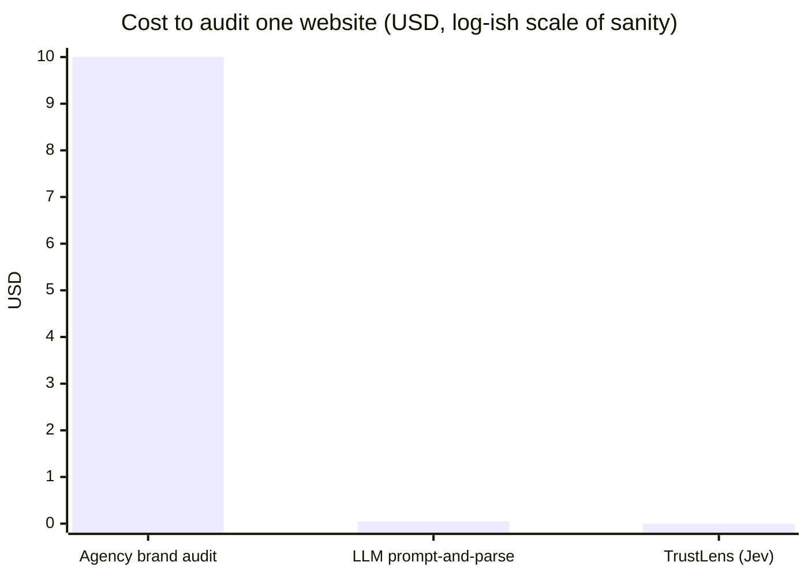
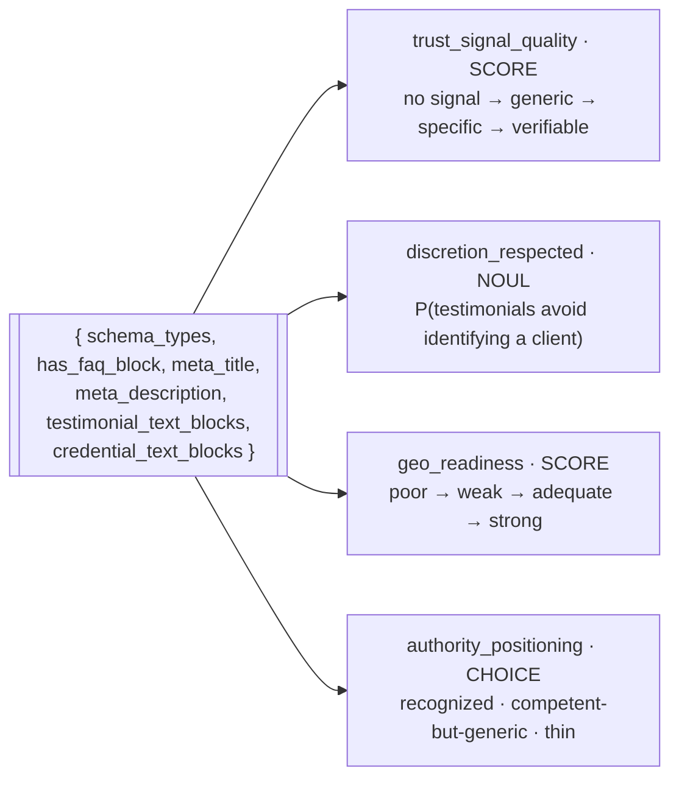
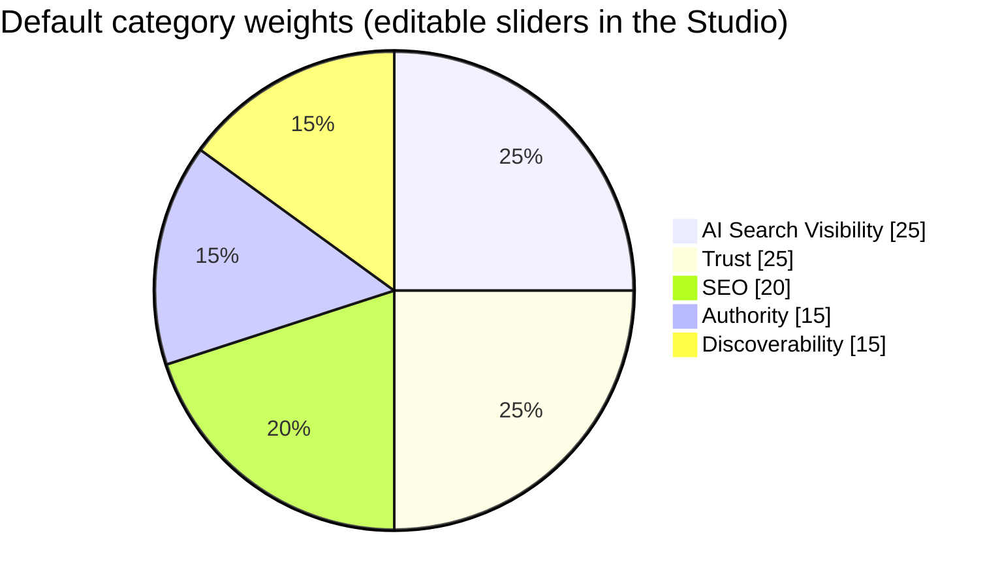
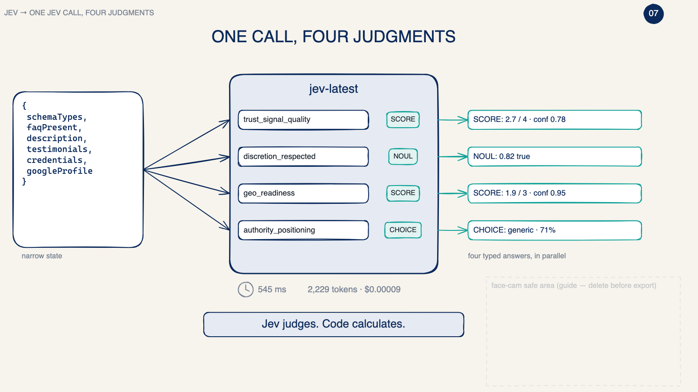
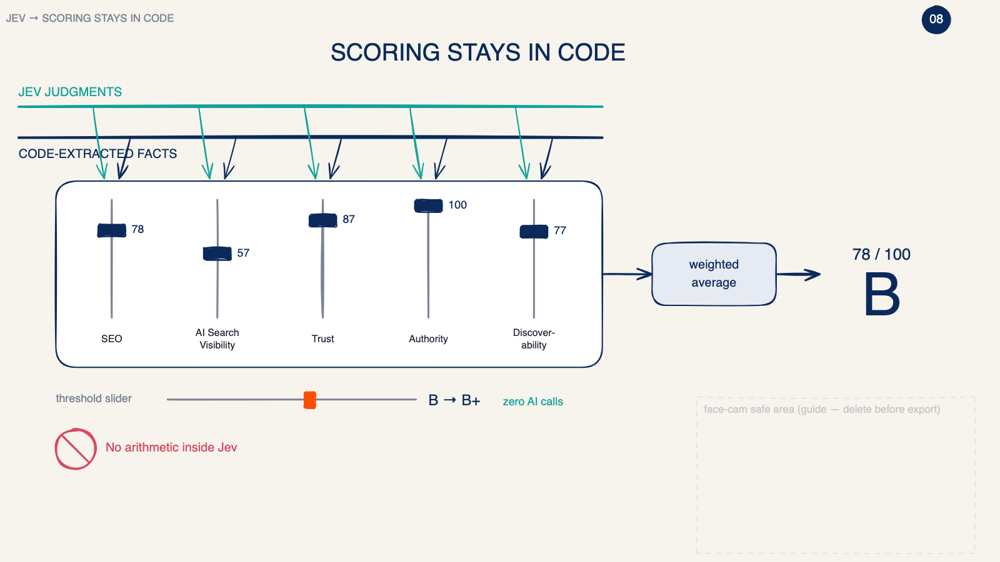

<p align="center">
  
</p>

<h1 align="center">TrustLens</h1>

<p align="center">
  <strong>A trust & AI-visibility auditor for service businesses, judged by a model that only makes decisions.</strong><br/>
  Paste a URL. Nine thousandths of a cent later you have a grade, five scores, a fix-it plan with points, and a card people actually share.
</p>

<p align="center">
  <a href="https://trustlens-mauve.vercel.app"></a>
  
  
  
  
</p>

---

## The thesis

Every "AI SEO tool" on the market pipes a whole webpage into an LLM and asks it to write an opinion. That is slow, expensive, and the opinion changes every time you run it.

TrustLens is built on a different bet: **most of an audit is not a judgment, it is a lookup.** Whether a page has FAQ schema, a meta description, a Google Business Profile link, a mobile viewport, or 847 bytes of empty React shell — code can answer all of that exactly, for free. The *only* things that need a mind are questions like "is this testimonial specific and verifiable?" or "does this business read as a recognized authority?"

So TrustLens keeps 90% of the work in deterministic code and hands the remaining 10% — four typed questions — to **Jev**, TypeSafe's System One model: no text generation, just calibrated probabilities, in about half a second, at **$0.042 per million input tokens** with output tokens free. The result is an audit that is reproducible, explainable, and cheap enough to give away.

```
                                       one site, end to end
   ┌────────────┐   ┌────────────┐   ┌────────────┐   ┌────────────┐   ┌────────────┐
   │ robots.txt │ → │ fetch 2    │ → │ extract 12 │ → │ Jev: niche │ → │ Jev: four  │ → grade
   │ respected  │   │ pages      │   │ signals    │   │ (1 choice) │   │ judgments  │
   └────────────┘   └────────────┘   └────────────┘   └────────────┘   └────────────┘
        code             code             code           ~400 ms          ~550 ms
```

## What you get

<table>
<tr>
<td width="50%">

**Single scan or Compare (2–5 sites, columns aligned row by row)**

Five categories, each 0–100, weighted into a letter grade:

| Category | Reads |
|---|---|
| **SEO** | PageSpeed, mobile viewport, title & description quality |
| **AI Search Visibility** | Jev's citation-readiness score + schema + FAQ |
| **Trust** | Jev's evidence score, discretion check, credentials |
| **Authority** | Jev's positioning call + credentials + Person/Org schema |
| **Discoverability** | Google profile, social links, content depth, freshness |

</td>
<td width="50%">

**Then the parts people share**

- A five-axis pentagon and a branded 1200×630 card with the site's favicon and domain
- A public results page per scan, with LinkedIn / X / copy / PNG
- A **fix-it report** where every action shows `+N pts` and the top reads *Now C 60 → All fixes +34 → New score A 94*
- A paste-in JSON-LD snippet pre-filled for the detected niche
- A Chrome extension that scrolls the live page and boxes every element it recognises while it scores

</td>
</tr>
</table>

## Real numbers (production, September 2026)

| Site | Type | Grade | Tokens | Cost | Finding |
|---|---|---|---|---|---|
| evergreenconsulting.co | agency-built practice | **B 78** | 3,728 | $0.00016 | No FAQ block; everything else lands |
| keystoneprep.com | peer practice | **F 24** | 1,479 | $0.00006 | Client-only React app — crawlers receive an empty `<div id="root">` |
| solomonadmissions.com | national firm | **C 70** | 2,875 | $0.00012 | 100+ named former admissions officers; no FAQ schema, no Google profile |
| rotorooter.com | home services | **C 60** | 2,875 | $0.00012 | Niche auto-detected; +34 pts available from credentials, FAQ, schema |

A full three-site comparison: **$0.0002.** Jev round trip: **~0.5–1.0 s.** Fetch + extract: **~0.5 s.**



> The first bar is capped at $10 for the chart; real agency audits start around $500. The point stands.

## Architecture

```mermaid
flowchart LR
    U[User / Chrome extension] -->|URL| API[/api/scan  Next.js, streams NDJSON/]
    API --> R{robots.txt}
    R -->|disallow| SKIP[flag as skipped]
    R -->|allow| F[fetch homepage + About]
    F --> X[Deterministic extractor\ncheerio · 12 fields]
    X --> C{{Field contract\nlib/contract.schema.json}}
    C -->|niche question| J1[(Jev)]
    J1 -->|niche key| Q[questionsFor(niche)]
    Q -->|4 typed questions, 1 call| J2[(Jev)]
    J2 --> S[scoreSite  weights · cutoffs · grade]
    X --> S
    S --> DB[(Convex\nscans · leads · spend · visitors)]
    S --> UI[Results · Compare · Report · Share card]
    DB --> LIVE[/history live feed + header totals]
    PSI[Google PageSpeed] -.late patch.-> S
```

**Jev never sees HTML.** Every question declares the fields it reads; a pre-build check fails the build if any default question reaches outside the contract; the API refuses custom questions that do. The exact JSON Jev received is shown under every result ("what Jev saw").

### The four judgments



Wording is templated per niche (`lib/niches.ts`): the AI-assistant question a parent asks about a college consultant becomes the one a homeowner asks about a plumber. Ten niches ship; adding one is a single object.

### Where the math lives



Points in the fix-it report are not guessed: each fix is applied to a copy of the extraction/answers and the same `scoreSite` runs again. Zero extra AI calls.

## Classifier Studio

`/studio` is the part that makes this a platform instead of a script:

- every Jev question as an editable card — instructions, levels/options, and checkboxes for which contract fields it may read
- convert between Score / Choice / Noul, reorder levels, add questions
- **Test on last 5 scanned sites** re-runs your edited questions on cached extractions (no refetch) and shows before → after answers
- threshold sliders re-grade instantly with zero AI calls
- presets save/load as JSON

## Chrome extension (demo build)

Click **Scan this page** and the tab scrolls itself: nav, headlines, logos, CTAs, paragraphs and stats get thin orange boxes; testimonials, credentials, Google profile and social links get solid orange with a pulse; a teal-to-orange beam sweeps the viewport. The score is deliberately held until the whole page has been read, then the panel reveals five categories, the grade, the pentagon, and a latency + cost meter.

Load it unpacked from `extension/` (or download the zip from `/extension`). Not on the Web Store by design.

<p align="center">
  
  
</p>

## Run it

```bash
git clone https://github.com/aayanrehman/trustlens && cd trustlens && npm install
sh scripts/setkeys.sh          # writes TYPESAFE_API_KEY / PAGESPEED_API_KEY to .env.local, input hidden
npx convex dev                 # creates your own Convex deployment and NEXT_PUBLIC_CONVEX_URL
npx convex env set TRUSTLENS_SECRET "$(openssl rand -hex 24)"   # and add the same value to .env.local
npm run dev
```

| Env var | Where | Purpose |
|---|---|---|
| `TYPESAFE_API_KEY` | server only | Jev |
| `PAGESPEED_API_KEY` | server only, optional | raises Google's PageSpeed quota |
| `NEXT_PUBLIC_CONVEX_URL` | public | your Convex deployment |
| `TRUSTLENS_SECRET` | server + Convex | signs server→Convex writes, salts IP hashes |
| `NEXT_PUBLIC_AGENCY_URL` | public, optional | where "Talk to Us" goes |

`npm run build` runs `scripts/selfcheck.ts` first: it fails the build if a default question reads outside the field contract, if the scoring math drifts, or if the rate limiter stops limiting.

```bash
npm run checkpoint -- https://example.com   # CLI: extracted fields + Jev answers side by side
```

## Repository map

```
lib/contract.schema.json   the 12-field contract — single source of truth
lib/extract.ts             robots.txt, fetch, cheerio extraction, client-only-shell detection
lib/niches.ts              ten niche profiles (audience, AI question, credentials, schema type)
lib/questions.ts           the niche question + four templated judgments + validator
lib/jev.ts                 the only file that talks to TypeSafe
lib/scoring.ts             weights, cutoffs, five categories, grade
lib/report.ts              fix-it actions with simulated points + JSON-LD generator
convex/                    scans, leads, spend, visitors — transactional rate limit
app/                       scan · compare · studio · history · audit/[id] · extension · privacy
extension/                 MV3 side panel + on-page boxing script
scripts/excalidraw-board.mjs   generates the 10-zone teaching board in docs/
```

## Guardrails

- robots.txt is honoured; disallowed sites are **skipped and flagged**, never silently dropped.
- Two pages per site, max. No crawling.
- No raw IPs stored — a salted hash, used only to enforce 60 sites / visitor / hour.
- Global spend cap ($3/day) enforced as a Convex transaction, so it holds across serverless instances.
- Only public page content is stored; nothing typed into the page, no cookies, no cross-site tracking. See `/privacy`.

## Credits

Built by [Aayan Rehman](https://waterfallgrowth.com) at Waterfall Growth in about a day, with Claude Code doing the typing and [TypeSafe's Jev](https://docs.typesafe.ai) doing the judging. If your practice scored a C, that's the point — the report tells you exactly which +N to chase first.
